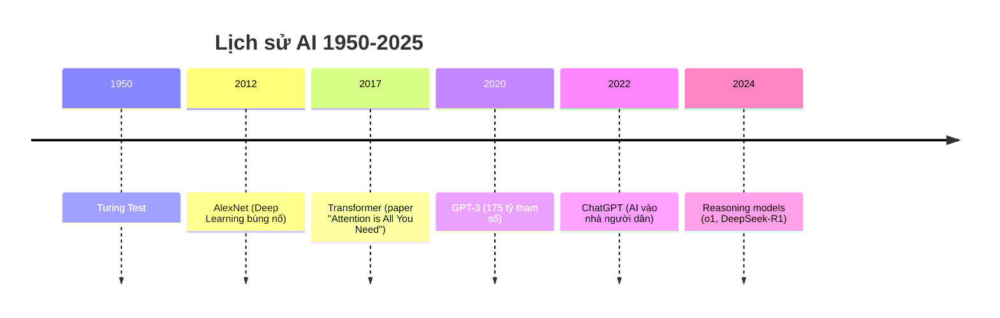

# DeepSeek Phỏng Vấn Mở Rộng — Implementation Plan

> **For agentic workers:** REQUIRED SUB-SKICK: Use superpowers:subagent-driven-development (recommended) or superpowers:executing-plans. Steps use checkbox (`- [ ]`) syntax.

**Goal:** Mở rộng bài phỏng vấn Lương Văn Phong (DeepSeek) thành tài liệu giáo dục AI ~40.000 chữ, 24 box kiến thức nền, 17 sơ đồ, từ điển jargon — cho người mới hoàn toàn + người đầu tư.

**Architecture:** Chèn Context Box (8 phần cấu trúc chuẩn) vào file Markdown gốc đã dịch, giữ nguyên dòng chảy phỏng vấn. WebSearch Mỹ bắt buộc cho box về Mỹ. Render PDF bằng WeasyPrint (đã fix layout).

**Tech Stack:** Markdown, Mermaid CLI (render sơ đồ), WeasyPrint (HTML→PDF), WebSearch (research Mỹ).

**Spec:** `docs/superpowers/specs/2026-07-23-deepseek-phong-van-mo-rong-design.md`

**File gốc:** `/Users/bobo/Downloads/梁文锋-投资者交流会-越南语译本.md`

**File output:**
- `/Users/bobo/Downloads/DeepSeek-Phong-van-Ban-mo-rong-cho-nguoi-moi-AI.md`
- `/Users/bobo/Downloads/DeepSeek-Phong-van-Ban-mo-rong-cho-nguoi-moi-AI.pdf`

---

## Cấu trúc task

Mình chia thành **6 giai đoạn**, mỗi giai đoạn là 1 task độc lập có thể commit riêng:

| Task | Nội dung | Ước tính |
|---|---|---|
| Task 1 | Setup file output + copy phỏng vấn gốc | 5 phút |
| Task 2 | Tạo 4 box Nhóm 2 (Lịch sử AI) + sơ đồ timeline | 30 phút |
| Task 3 | Tạo 10 box Nhóm 1 (AI cốt lõi) + sơ đồ | 60 phút |
| Task 4 | Tạo 5 box Nhóm 3 (Kinh tế AI) + sơ đồ | 45 phút |
| Task 5 | Tạo 5 box Nhóm 4 (Phần cứng) + sơ đồ | 45 phút |
| Task 6 | Từ điển jargon 80-100 từ + phụ lục | 30 phút |
| Task 7 | Chèn tất cả box vào file + render PDF + verify | 30 phút |

---

## Task 1: Setup file output

**Files:**
- Create: `/Users/bobo/Downloads/DeepSeek-Phong-van-Ban-mo-rong-cho-nguoi-moi-AI.md`

- [ ] **Step 1: Copy file phỏng vấn gốc sang file output mới**

```bash
cp "/Users/bobo/Downloads/梁文锋-投资者交流会-越南语译本.md" \
   "/Users/bobo/Downloads/DeepSeek-Phong-van-Ban-mo-rong-cho-nguoi-moi-AI.md"
```

- [ ] **Step 2: Thêm header ghi chú "bản mở rộng" ở đầu file**

Chèn ngay sau dòng 1 (sau `# Cuộc giao lưu...`):

```markdown
> 📘 **BẢN MỞ RỘNG CHO NGƯỜI MỚI** — Tài liệu này bổ sung 24 mục "Kiến thức nền" và từ điển jargon vào bản phỏng vấn gốc. Mục "Kiến thức nền" nằm trong khung vàng `📚`, có thể bỏ qua nếu đã biết.
```

- [ ] **Step 3: Verify file tạo thành công**

Run: `wc -l "/Users/bobo/Downloads/DeepSeek-Phong-van-Ban-mo-rong-cho-nguoi-moi-AI.md"`
Expected: ~1200 dòng (bằng file gốc)

---

## Task 2: Nhóm 2 — Lịch sử AI (4 box)

**Files:**
- Modify: `/Users/bobo/Downloads/DeepSeek-Phong-van-Ban-mo-rong-cho-nguoi-moi-AI.md`
- Create: `/tmp/deepseek-pdf/mermaid/box11-timeline.mmd`

**Research BẮT BUỘC** (WebSearch Mỹ): 4 box đều cần research.

- [ ] **Step 1: WebSearch lịch sử AI**

```
Query 1: "AI history milestones Turing 1950 deep learning GPT timeline"
Query 2: "ChatGPT launch November 2022 fastest growing user base"
Query 3: "DeepSeek company history founded Liang Wenfang 2023"
Query 4: "Liang Wenfang DeepSeek founder background quant hedge"
```

Thu thập: 6 cột mốc AI (1950 Turing → 2012 AlexNet → 2017 Transformer → 2020 GPT-3 → 2022 ChatGPT → 2024-2025 Reasoning models), số liệu ChatGPT user, tiểu sử Lương Văn Phong.

- [ ] **Step 2: Viết Box #11 — Lịch sử AI rút gọn (1950→2025)**

Cấu trúc 9 phần theo spec. Chèn ở đầu tài liệu (sau Glossary nhanh). Trích dẫn: không có (box giới thiệu).

- [ ] **Step 3: Viết Box #12 — Tại sao AI bùng nổ 2022**

9 phần. Chèn ngay sau Box #11. Trích dẫn: không.

- [ ] **Step 4: Viết Box #13 — DeepSeek là ai**

9 phần. Chèn ở Chương 1 (sau đoạn đầu nói về DeepSeek). Trích dẫn thật từ phỏng vấn.

- [ ] **Step 5: Viết Box #14 — Lương Văn Phong là ai**

9 phần. Chèn ở Chương 1 (ngay Box #13). Trích dẫn thật.

- [ ] **Step 6: Tạo sơ đồ Mermaid Timeline AI (sơ đồ mới #1)**



Render → resize 643px → nhúng vào Box #11.

- [ ] **Step 7: Commit**

```bash
git add "/Users/bobo/Downloads/DeepSeek-Phong-van-Ban-mo-rong-cho-nguoi-moi-AI.md"
git commit -m "feat: thêm 4 box Nhóm 2 (Lịch sử AI) + sơ đồ timeline"
```

---

## Task 3: Nhóm 1 — Khái niệm AI cốt lõi (10 box)

**Files:**
- Modify: `/Users/bobo/Downloads/DeepSeek-Phong-van-Ban-mo-rong-cho-nguoi-moi-AI.md`
- Create: 4 file sơ đồ Mermaid mới

**Research BẮT BUỘC**: Box LLM, CoT, Agent, Scaling, Multimodal cần verify jargon Mỹ.

- [ ] **Step 1: WebSearch jargon AI cốt lõi**

```
Query 1: "LLM terms jargon params weights fine-tune context window"
Query 2: "chain of thought reasoning test-time compute thinking model"
Query 3: "AI agent function calling tool use MCP agentic loop"
Query 4: "scaling law compute FLOPs training run"
Query 5: "multimodal AI vision language model GPT-4V"
Query 6: "AI hallucination RAG grounding confabulation"
```

- [ ] **Step 2: Viết Box #1 — AGI là gì?**

9 phần. Chèn ở Chương 1 (sau "mục tiêu dài hạn AGI"). Trích dẫn thật.

- [ ] **Step 3: Viết Box #2 — LLM**

9 phần. Chèn Chương 2 (sau "bậc thang 1: mô hình ngôn ngữ"). Tạo sơ đồ #2 Pipeline LLM.

- [ ] **Step 4: Viết Box #3 — CoT**

9 phần (đã có mẫu ở spec). Chèn Chương 2 (sau "bậc 2: CoT"). Tạo sơ đồ #3 So sánh CoT.

- [ ] **Step 5: Viết Box #4 — Agent**

9 phần. Chèn Chương 2 (sau "bậc 3: Agent"). Tạo sơ đồ #4 Agentic loop.

- [ ] **Step 6: Viết Box #5 — Học liên tục**

9 phần. Chèn Chương 2 (sau "bậc 4: học liên tục").

- [ ] **Step 7: Viết Box #6 — Singularity**

9 phần. Chèn Chương 2 (sau "điểm kỳ diệu").

- [ ] **Step 8: Viết Box #7 — Embodied AI**

9 phần. Chèn Chương 2 (sau "embodied AI").

- [ ] **Step 9: Viết Box #8 — Hallucination**

9 phần. Chèn Chương 5 (sau "ảo giác").

- [ ] **Step 10: Viết Box #9 — Scaling Law**

9 phần. Chèn Chương 6 (sau "Scaling"). Tạo sơ đồ #5 Scaling chart.

- [ ] **Step 11: Viết Box #10 — Multimodal**

9 phần. Chèn Chương 8 (sau "multimodal").

- [ ] **Step 12: Render 4 sơ đồ Mermaid + resize 643px**

```bash
for f in box02-llm-pipeline box03-cot-compare box04-agentic-loop box09-scaling; do
  mmdc -i ${f}.mmd -o png/${f}.png -w 1800 -s 3 -b white -p puppeteer-config.json
  sips --resampleHeightWidth $NEW_H 643 ...
done
```

- [ ] **Step 13: Commit**

```bash
git commit -m "feat: thêm 10 box Nhóm 1 (AI cốt lõi) + 4 sơ đồ"
```

---

## Task 4: Nhóm 3 — Kinh tế AI (5 box)

**Files:**
- Modify: file output
- Create: 2 sơ đồ Mermaid

**Research BẮT BUỘC** (WebSearch Mỹ): cả 5 box.

- [ ] **Step 1: WebSearch kinh tế AI**

```
Query 1: "OpenAI API pricing per token GPT-4 2025"
Query 2: "open weights vs open source AI debate Meta Llama"
Query 3: "AI market share 2025 OpenAI Anthropic Google revenue"
Query 4: "US China AI race export controls semiconductor"
Query 5: "OpenAI Anthropic Google DeepMind Meta AI labs comparison"
```

- [ ] **Step 2: Viết Box #15 — API + định giá**

9 phần. Chèn Chương 4 (sau "thu hồi vốn 10 tháng").

- [ ] **Step 3: Viết Box #16 — Open source vs Closed**

9 phần. Chèn Chương 4.

- [ ] **Step 4: Viết Box #17 — Thị trường AI toàn cầu**

9 phần. Chèn Chương 4. Tạo sơ đồ #7 Bảng Big 4 + DeepSeek.

- [ ] **Step 5: Viết Box #18 — Cuộc đua Mỹ-Trung**

9 phần. Chèn Chương 8 (sau "gap Mỹ-Trung"). Tạo sơ đồ #8 So sánh Mỹ-Trung.

- [ ] **Step 6: Viết Box #19 — Big 4 (OpenAI/Anthropic/Google/Meta)**

9 phần. Chèn Chương 8.

- [ ] **Step 7: Render 2 sơ đồ + resize 643px**

- [ ] **Step 8: Commit**

---

## Task 5: Nhóm 4 — Phần cứng AI (5 box)

**Files:**
- Modify: file output
- Create: 1 sơ đồ Mermaid

**Research BẮT BUỘC** (WebSearch Mỹ): Box #20, #21, #22, #24.

- [ ] **Step 1: WebSearch phần cứng AI**

```
Query 1: "NVIDIA H100 B200 GPU price AI 2025"
Query 2: "NVIDIA CUDA moat market share GPU AI"
Query 3: "what is CUDA how GPU programming works"
Query 4: "TSMC semiconductor supply chain AI chips"
Query 5: "Huawei Ascend 950 vs NVIDIA GPU China"
```

- [ ] **Step 2: Viết Box #20 — GPU/Card AI**

9 phần. Chèn Chương 3 (sau "20.000 card").

- [ ] **Step 3: Viết Box #21 — NVIDIA độc quyền**

9 phần. Chèn Chương 5 (sau "hào nước CUDA"). Tạo sơ đồ #6 Stack GPU/CUDA.

- [ ] **Step 4: Viết Box #22 — CUDA là gì**

9 phần. Chèn Chương 5.

- [ ] **Step 5: Viết Box #23 — Chip Huawei vs NVIDIA**

9 phần. Chèn Chương 5 (sau "4 Huawei = 1 NVIDIA").

- [ ] **Step 6: Viết Box #24 — TSMC & chuỗi cung ứng**

9 phần. Chèn Chương 5.

- [ ] **Step 7: Render sơ đồ #6 + resize**

- [ ] **Step 8: Commit**

---

## Task 6: Từ điển jargon + phụ lục

**Files:**
- Modify: file output (chèn ở cuối)

- [ ] **Step 1: WebSearch verify 80-100 từ jargon**

Tìm các từ: FLOPs, context window, weights, params, fine-tune, RLHF, system prompt, prompt, token, inference, training, pre-training, post-training, grounding, RAG, kernel, PTX, Triton, HBM, throughput, TTFT, TPS, endpoint, rate limit, agentic, tool use, function calling, MCP, multi-agent, reasoning, test-time compute, scaling law, emergent ability, alignment, safety, frontier model, base model, MoE, dense model, sparse, open weights, distilled, quantization, GGUF, LoRA, etc.

- [ ] **Step 2: Viết bảng từ điển 4 cột**

| Thuật ngữ | Nghĩa Việt | Ngữ cảnh | Ví dụ |

80-100 dòng.

- [ ] **Step 3: Viết phụ lục "Tóm tắt cho người đầu tư"**

1-2 trang tóm tắt cơ hội rủi ro AI cho người đầu tư (dựa trên phỏng vấn).

- [ ] **Step 4: Commit**

---

## Task 7: Render PDF cuối + verify

**Files:**
- Output: `/Users/bobo/Downloads/DeepSeek-Phong-van-Ban-mo-rong-cho-nguoi-moi-AI.pdf`

- [ ] **Step 1: Pandoc MD → HTML**

```bash
pandoc input.md -f markdown-yaml_metadata_block -t html5 --standalone \
  --metadata title="..." --css style.css --embed-resources -o deepseek.html
```

- [ ] **Step 2: Xóa meta viewport + header pandoc**

```python
import re
html = re.sub(r'<meta name="viewport"[^>]*/?>', '', html)
html = re.sub(r'<header id="title-block-header">.*?</header>', '', html, flags=re.DOTALL)
```

- [ ] **Step 3: WeasyPrint HTML → PDF**

```bash
/tmp/deepseek-pdf/venv/bin/weasyprint deepseek-clean.html output.pdf
```

- [ ] **Step 4: Verify pixel 17 sơ đồ đạt 70%+ width**

```python
# Đo pixel tất cả trang có ảnh 643px
# Kỳ vọng: tất cả ≥ 70%
```

- [ ] **Step 5: Verify số liệu không bịa**

Cross-check mọi số trong box vs WebSearch source.

- [ ] **Step 6: Verify trích dẫn thật**

Grep mỗi "LIÊN KẾT BÀI PHỎNG VẤN" → câu phải có trong transcript gốc.

- [ ] **Step 7: Mở PDF cho user**

```bash
open output.pdf
```

- [ ] **Step 8: Commit cuối**

```bash
git commit -m "feat: tài liệu mở rộng hoàn thành — 24 box + 17 sơ đồ + từ điển jargon"
```

---

## Self-Review

### Spec coverage
- ✅ 24 box (10 + 4 + 5 + 5) → Task 2, 3, 4, 5
- ✅ Cấu trúc 9 phần mỗi box → tất cả task viết box
- ✅ 8 sơ đồ mới → Task 2 (1), 3 (4), 4 (2), 5 (1)
- ✅ Từ điển jargon → Task 6
- ✅ WebSearch Mỹ bắt buộc → Mọi task có "Step WebSearch"
- ✅ File output MD + PDF → Task 1, 7
- ✅ Verify chất lượng → Task 7

### Placeholder scan
- Không có "TBD" / "TODO"
- Mỗi step có nội dung cụ thể

### Type consistency
- File path nhất quán xuyên suốt
- Cấu trúc box 9 phần nhất quán

---

## Execution Handoff

Plan hoàn tất, lưu tại `docs/superpowers/plans/2026-07-23-deepseek-phong-van-mo-rong.md`.
